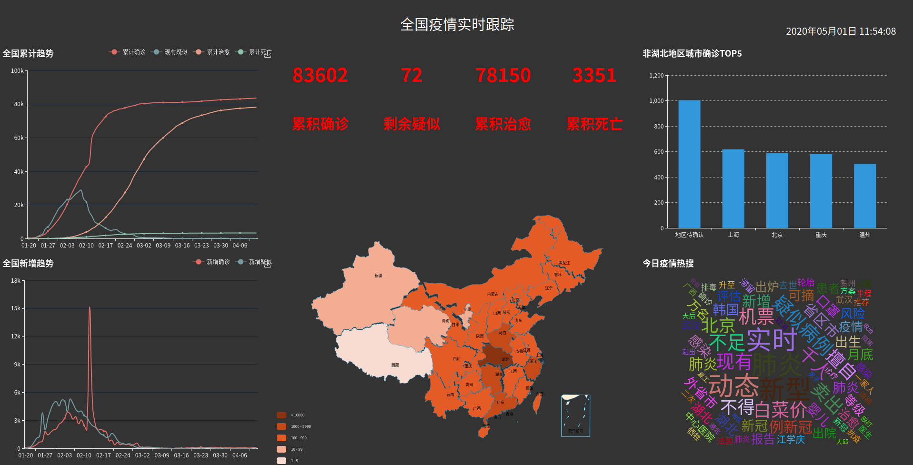

`COV`数据可视化

时间:2020.01.20 -- 2020.04.12



- spider文件为数据爬取文件

主要数据来源：

```
https://view.inews.qq.com/g2/getOnsInfo?name=disease_h5
https://view.inews.qq.com/g2/getOnsInfo?name=disease_other
```

后续可能不能访问，在此保存了`sql`文件:`cov.sql`,您只需导入即可

- 使用前请修改相应的`sql`连接配置

  `spider.py `& `utils.py`

```python
 conn = pymysql.connect(host="######", user="#####", password="#######", db="cov", charset="utf8")
```

